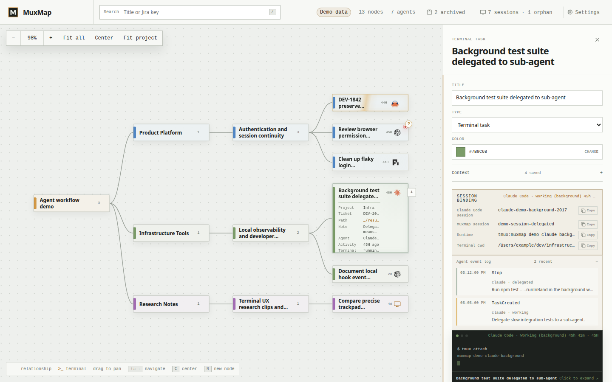

# MuxMap

[](https://github.com/syntaxskills/muxmap/actions/workflows/ci.yml)

MuxMap is a local-first mindmap for organizing development work around persistent terminals.

The map stays readable. Terminals attach only to the nodes that need execution. Browser refreshes detach the client, not the running tmux or Zellij session.



## What it does

- Organize repos, features, tickets, notes, and terminal tasks in a compact tree.
- Attach a persistent terminal to any node, then dock, float, resize, or full-screen it.
- Reopen the browser and reattach to the same session.
- Manage orphan `muxmap*` sessions instead of leaving hidden tmux/Zellij clutter.
- Track Codex, Claude Code, Pi, and SSH activity with optional system or in-page notifications.
- Tune the workspace through a VS Code-style settings UI or JSON editor.

## Quick start

Requirements:

- Node.js 22+
- Native build tools for `node-pty`
- tmux on macOS/Linux, or Zellij 0.44.3+ on Windows

```bash
npm install
npm run dev
```

Open <http://127.0.0.1:5173>.

For the production server:

```bash
npm run build
npm start
```

Open <http://127.0.0.1:4782>.

## Agent hooks

Agent hooks are optional. They let MuxMap mark agent sessions as working, completed, read, unavailable, or needing input.

```bash
npm run hooks:install
npm run hooks:status
npm run hooks:update
```

Hooks are safe outside MuxMap sessions: plain terminals no-op, ordinary tmux sessions are ignored, and live `muxmap*` sessions can appear as orphans for adoption.

## Access modes

MuxMap starts in local mode and binds only `127.0.0.1`. Use `npm run doctor` before exposing it to another device.

| Mode | Use case | Auth |
| --- | --- | --- |
| `local` | Same machine only | Local session cookie |
| `lan` | Trusted local network | `MUXMAP_TOKEN` Basic Auth |
| `tailscale` | Tailnet access | `MUXMAP_TOKEN` Basic Auth |

Password-free LAN/Tailscale mode is explicit via `MUXMAP_AUTH=none`. That exposes terminal control to clients allowed by your network and firewall.

## Verify

```bash
npm test
npm run lint
npm run build
npm run doctor
```

## Docs

- [Product and technical design](docs/PRD.md)
- [Architecture](docs/ARCHITECTURE.md)
- [Agent hooks](docs/AGENT-HOOKS.md)
- [Windows LAN/Tailscale setup](docs/WINDOWS-NETWORK.md)
- [Acceptance coverage](docs/ACCEPTANCE.md)
- [Changelog](CHANGELOG.md)
- [MIT License](LICENSE)
