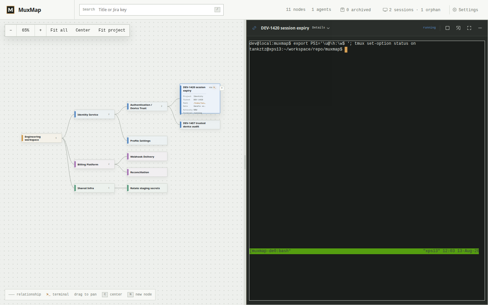
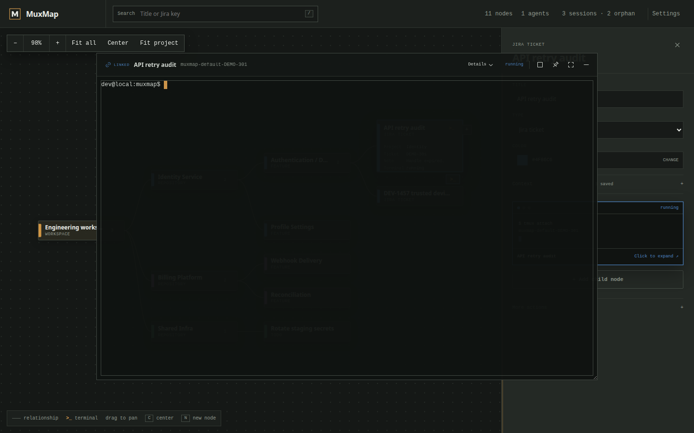
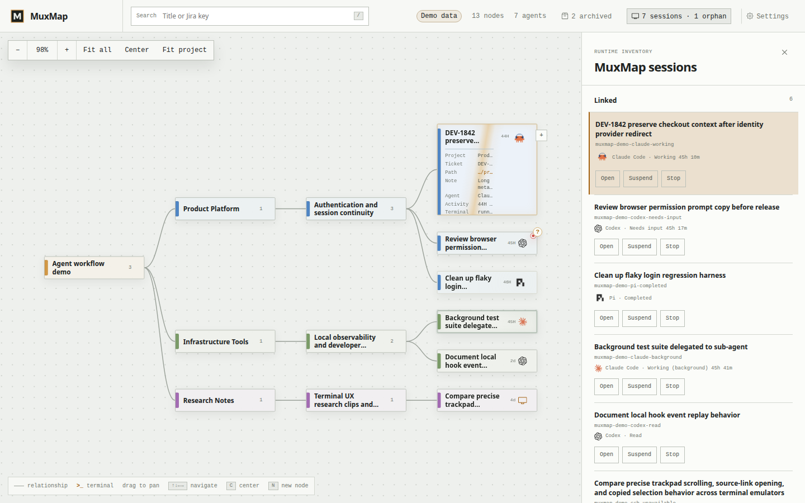
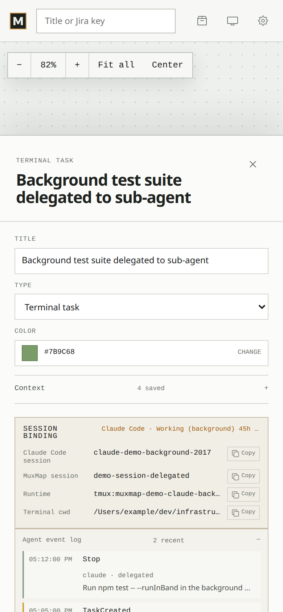
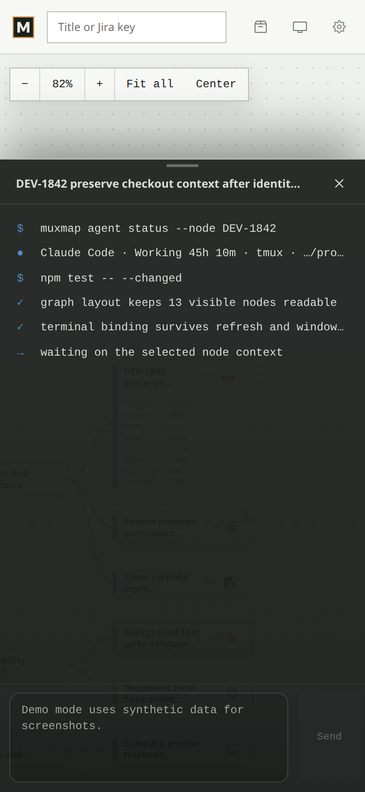
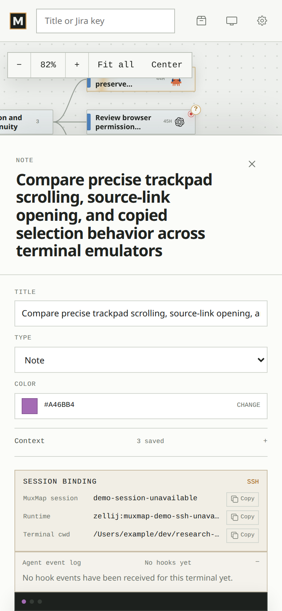

# Screenshots

These screenshots show the main MuxMap flows: organizing work in the map, opening the right terminal quickly, managing sessions, and using the mobile layout.

## Main workflow: map on the left, terminal on the right

The primary workflow is a split workspace. The mindmap keeps project context visible while the selected node owns the terminal on the right.

## Workspace map and node actions

Nodes can represent repos, features, tickets, notes, todos, or terminal tasks. The map stays compact; node details and common actions appear only when needed.

## Floating terminal

Terminals can also float above the map when you need more flexible placement, then dock or full-screen again.

## Sessions and orphans

MuxMap inventories live `muxmap*` tmux or Zellij sessions, including orphaned sessions that no longer belong to a visible node. You can adopt or stop them explicitly.

## Mobile map

On small screens, the map remains the entry point for choosing the node and context.

## Mobile terminal

The terminal opens as a bottom sheet so the selected work stays connected to the map.

## Mobile details

Node details, metadata, and terminal controls stay available without crowding the map.

